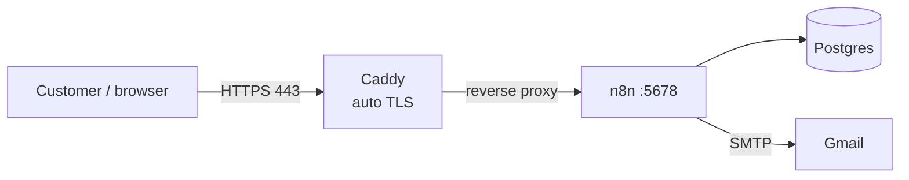

# Deploy n8n to a VPS

Self-hosted n8n with **Postgres** (production database) and **Caddy**
(automatic HTTPS). This is what runs the *Orders → Odoo → Email* workflow
([`../orders-to-odoo-workflow.json`](../orders-to-odoo-workflow.json)).



## 1. Prerequisites

- A **VPS** (Hetzner / DigitalOcean / Linode …), 2 GB RAM minimum, Ubuntu 22.04+.
- A **domain** (e.g. `n8n.yourdomain.com`) with a **DNS A record** pointing at
  the VPS public IP. *(Caddy cannot issue a certificate without this.)*
- **Ports 80 and 443 open** in the VPS firewall.
- **Docker + Compose plugin** on the VPS:
  ```bash
  curl -fsSL https://get.docker.com | sh
  ```

## 2. Get the files onto the server

Clone the repo (or copy just this `deploy/` folder plus the workflow JSON):

```bash
git clone <your-repo-url> n8n-deploy
cd n8n-deploy/deploy
```

## 3. Configure environment

```bash
cp .env.example .env
nano .env
```

Set every value. Generate the encryption key with:

```bash
openssl rand -hex 24
```

Put that into `N8N_ENCRYPTION_KEY`, set a strong `POSTGRES_PASSWORD`, and set
`DOMAIN` to your real domain. **Back up the encryption key somewhere safe.**

## 4. Launch

```bash
docker compose up -d
```

Watch it come up:

```bash
docker compose logs -f n8n
```

Give Caddy ~30 s to fetch the TLS certificate, then open
`https://<your-domain>`. You'll see the **Set up owner account** screen —
create your admin login.

## 5. Import the workflow

1. In the live n8n: **Create Workflow → ⋮ menu → Import from File**.
2. Upload [`../orders-to-odoo-workflow.json`](../orders-to-odoo-workflow.json).
3. Re-enter the **Gmail SMTP credential** on the *Send Email* node
   (credentials are never stored in the JSON, by design):

   | Field | Value |
   |-------|-------|
   | User | `notifications.vmeals@gmail.com` |
   | Password | *(Gmail app password)* |
   | Host | `smtp.gmail.com` |
   | Port | `465` |
   | SSL/TLS | ON |

4. Open the **Build Odoo File** node and edit the `COLS` map at the top so each
   field points at the real header names in your Salla export. (The source of
   this code lives in [`../workflow/transform.js`](../workflow/transform.js); run
   `node workflow/build.mjs` to regenerate the workflow JSON after editing.)
5. Toggle the workflow **Active** (top-right). The Form Trigger exposes a public
   URL: `https://<your-domain>/form/...`. Open it, upload the Salla export, enter
   the **Series Number** + **Report Date**, and the result is emailed to you.

## 6. Common operations

```bash
docker compose build --pull && docker compose up -d   # rebuild + update n8n
docker compose down                                   # stop (keeps data volumes)
docker compose logs -f n8n                             # tail logs
```

> The n8n service is built from [`Dockerfile`](Dockerfile), which bundles the
> `exceljs` library. The Code node uses it (allowed via
> `NODE_FUNCTION_ALLOW_EXTERNAL=exceljs`) to build the styled, two-tab `.xlsx`.
> If you change the image, rebuild with `docker compose build --pull`.

## 7. Backups (do not skip)

Your data lives in named Docker volumes: `pgdata` (database) and `n8ndata`
(n8n config + encryption-dependent state).

```bash
# Database dump
docker compose exec postgres pg_dump -U "$POSTGRES_USER" "$POSTGRES_DB" > backup.sql
```

Also keep a copy of `N8N_ENCRYPTION_KEY` — without it, a restored database
cannot decrypt stored credentials.

## Notes

- The Form Trigger and webhooks **require** the public HTTPS URL — that's why
  `WEBHOOK_URL` / `N8N_HOST` are set. Don't run this behind plain HTTP.
- Gmail's From address **must** equal the authenticated account
  (`notifications.vmeals@gmail.com`), or Gmail rejects the message.
- For high volume later, look at n8n **queue mode** (Redis + workers).
