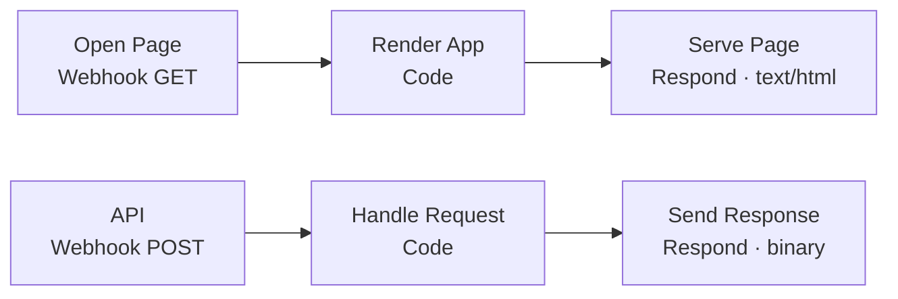

# Forecast Builder — n8n workflow

Import file: [`legend-sleep-forecast-builder.workflow.json`](legend-sleep-forecast-builder.workflow.json)

Replaces manual entry in the monthly forecast workbook. You browse your products,
type monthly quantities, and get the workbook back fully calculated.

Companion doc: [`sales-forecast-workbook.md`](sales-forecast-workbook.md) — the
full decode of the workbook this drives.

> **Not in the repo:** `sales-forecast-workbook.md`, `sku-catalog.csv` and the
> `.xlsx` are gitignored (see [`docs/.gitignore`](.gitignore)) because this
> repository is public and they contain the full pricing structure, revenue
> forecast and ad budgets. Nothing needs them in the repo — the product list is
> read from the workbook you upload, at runtime.

---

## 1. Setup

**There is no deployment step.** Nothing to install, no env vars, no container
restart, no files on the server. Both Code nodes are pure JavaScript with zero
`require()` calls — they carry their own DEFLATE decompressor — so importing the
JSON is all there is.

1. Workflows → **Import from File** (or **Import from URL**) → the JSON above
2. **Activate** the workflow
3. Open the **Open Page** node, copy its **Production URL**, open it in a browser:
   ```
   https://<your-n8n-host>/webhook/legend-forecast
   ```

That URL *is* the app. Bookmark it.

While building, use the Test URL and click **Execute workflow** first — test
webhooks only listen for one request.

---

## 2. Using it

Four steps in one page. Your file stays in the browser the whole time, so nothing
is uploaded twice.

### 1 · Workbook

Drop in your current `.xlsx`, set the report month and the default channel. The
file is the template — you get your own workbook back, same 11 tabs, same
formulas, same 6 charts, never modified in place.

### 2 · Products

This is the part the old form got wrong. You now get **all 726 products in a
table**, read out of the file you just uploaded:

| Column | |
|---|---|
| SKU | e.g. `LS-382` |
| Product | the Arabic name, right-aligned |
| Category | from your sheet, or inferred — flagged if unknown |
| Price | the promo price, which is the basis the forecast actually uses |
| Channel | per-row override of the default |
| Qty / month | the only thing you normally type |

- **Search** filters live on Arabic name *or* SKU — no need to know codes.
- **Category chips** narrow to Royal Boxes, Mattresses, Toppers, Pillows,
  Comforters. **Only picked** hides everything you haven't given a quantity.
- Type a monthly quantity and it splits `24 / 15 / 11 / 20 / 30 %` automatically.
- Click **⌄** on a row *only* when you want to set weeks by hand. Editing any week
  switches that row to manual and shows exactly what will be written; **Reset to
  auto** puts it back.
- The footer keeps a running count: products picked, total units, units per week,
  and forecast revenue — updating as you type.

### 3 · Marketing spend

Separate step, all optional. Three levels, highest precedence first:

1. **Detailed lines** — `category, platform, amount`, one per line
2. **W1–W5** — five numbers, used as-is
3. **Total** — one number, split on the same curve

Leave all three blank and the spend already in your workbook is untouched. A live
ROAS readout shows revenue-before-VAT ÷ spend against the 20× target — with a note
that it compares *all* revenue to that spend, so if your spend is online-only the
online-only figure is the meaningful one (defect **D1**).

### 4 · Download

The workbook downloads as `Sales Forecast <YYYY-MM> (generated).xlsx`, with a
summary of rows written, units per week and any warnings.

---

## 3. What it fills in for you

Deliberately narrow: only the input columns are written, and the workbook's own
formulas do the rest.

| Sheet | Written | Left alone |
|---|---|---|
| `Sales_Forecast` | `A` channel, `B` category, `D` SKU, `E` week, `F` units | `C` name, `G` price, `H` revenue, `I` before-VAT, `K`/`L`/`M` variance — still formulas |
| `Marketing_Expense_Forecast` | `A`–`E`, plus a `G` variance formula | everything else |
| `Config & Assumptions` | `B3` report month, `A11:C15` week table | VAT, all dropdown lists |
| everything else | — | Summaries, Dashboard, charts, Pricelist untouched |

Derived automatically:

- **Category** — from the SKU→category pairs already in your `Sales_Forecast`
  where available (exact), otherwise from the Arabic name. If neither resolves it
  is left **blank and flagged**, never guessed.

  > **Keyword order is load-bearing.** Names are compound, so
  > `رويال بوكس بمفرش لورين` — a Royal Box *containing* a bedspread — must match
  > `رويال` before `مفرش`, and `واقي مرتبة` (protector) before `مرتبة`. The shipped
  > order scores **158/160 (98.8%)**; an earlier order scored **58%**. Don't
  > reorder without re-scoring.

- **Price and product name** — from the workbook's own `VLOOKUP`s. A SKU missing
  from the Pricelist warns instead of silently reading zero.
- **The week table** — regenerated from the report month (W1 = days 1–7 … W5 = day
  29–month end), fixing defect **D4**, where the current file still says May.

Afterwards `fullCalcOnLoad` is set and the stale calc chain dropped, so Excel
recalculates everything on open.

**On file size.** Untouched parts are copied through as their original compressed
bytes; the six rewritten parts are stored uncompressed, because shipping a DEFLATE
*compressor* in a Code node isn't worth it. Output is ~900 KB from a 243 KB input.
Excel doesn't mind, and re-saving shrinks it.

---

## 4. The split

Exact parity with the sheet:

| W1 | W2 | W3 | W4 | W5 |
|---:|---:|---:|---:|---:|
| 24% | 15% | 11% | 20% | 30% |

Pinned weeks are honoured first; the remainder is spread over the unpinned weeks
on their renormalised weights, so the monthly total always ties. Pinning W3 to 200
out of 400 gives `53.93 / 33.71 / 200 / 44.94 / 67.42` — summing to exactly 400.

Units stay fractional, matching the current file (defect **D8**).

---

## 5. Workflow shape



Two routes on one path:

| Route | Does |
|---|---|
| `GET /webhook/legend-forecast` | serves the app |
| `POST` + `action=catalog` | reads the uploaded workbook, returns its 726 products as JSON |
| `POST` + `action=build` | writes the forecast, returns the `.xlsx` |

Both POST replies go out as **binary**, so a single Respond node covers them —
`getBinaryResponse` sets `content-type` from each binary's `mimeType`
(`application/json` or the xlsx type). Errors are returned as JSON too, so the
page can show a clean message instead of an n8n stack trace.

### Why a served page and not an n8n Form

Not a preference — a hard wall. n8n form fields are static, and
`prepareFormFields` runs `sanitizeHtml(field.html)`, so a Custom HTML field cannot
carry any script. Search, 726 browsable rows and a live preview are all impossible
inside the form UI. `RespondToWebhook` serves raw HTML, so it isn't.

### If you edit it

- **The Code nodes have no dependencies.** They carry a raw-DEFLATE decompressor
  (RFC 1951), verified byte-identical to `zlib.inflateRawSync` on every part of the
  real workbook. Don't "simplify" it to `require('zlib')` — that reintroduces
  `NODE_FUNCTION_ALLOW_BUILTIN` and a container restart.
- **One HTTP method per Webhook node**, hence two of them on the same path.
- The page HTML is embedded as a JSON-encoded string literal, so quotes, backticks,
  `${...}` and Arabic text inside it can't break the node. Edit `ui.html` and
  rebuild rather than hand-patching the JSON.

---

## 6. Errors you might hit

Anything the server rejects comes back as a readable message in the page.

| Message | Cause |
|---|---|
| `No .xlsx reached the server` | the upload didn't arrive; re-attach |
| `That file has no Pricelist tab where expected` | wrong file, or tabs reordered — includes the part count, byte length, leading magic bytes and what was actually found |
| `Uploaded file does not look like the … workbook` | same, for the build step |
| `Report month must look like 2026-08` | bad month format |
| `No products had a quantity` | nothing picked |
| `Line "…" — give either 1 monthly quantity or 5 weekly quantities` | a malformed row |
| `DEFLATE: …` / `Corrupt ZIP central directory` | the file isn't a valid .xlsx, or is truncated |
| `Entry … claims N bytes uncompressed — refusing` | 64 MB per-entry guard tripped |
| `SKU "…" could not be categorised` (warning) | row written, category blank — set it in the sheet |

---

## 7. Limits

- **186 SKU/channel lines** max (930 rows ÷ 5 weeks) — the template's formulas stop
  at row 935. Over that is a hard error, not a silent trim.
- **40 spend lines** max (200 rows ÷ 5 weeks).
- Only the input tabs are written. `Campaigns_Plan` and `Price_Changes_Plan` are
  still manual.
- It does **not** fix defects **D1** (contradictory ROAS bases), **D2** (hardcoded
  campaign revenue) or **D3** (broken GM-approval column) — those live in the
  workbook's own formulas.
- Sheets are addressed by file position (`sheet2`…`sheet5`), not name. Reorder or
  insert tabs and the workflow refuses the file rather than corrupting it.
- **The webhook is unauthenticated.** Anyone with the URL can use it. The Webhook
  node supports Basic Auth / header auth — set it if the host is reachable from the
  internet.
