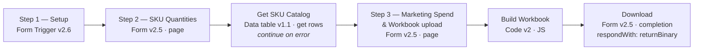

# Forecast Builder — n8n workflow

Import file: [`legend-sleep-forecast-builder.workflow.json`](legend-sleep-forecast-builder.workflow.json)

Replaces manual entry in the forecast workbook. You give it **SKUs and monthly
quantities**; it splits them across the five weeks on the sheet's own curve,
writes them into your workbook, and hands the file back fully calculated.

Companion doc: [`sales-forecast-workbook.md`](sales-forecast-workbook.md) — the
full decode of the workbook this drives.

> **Not in the repo:** `sales-forecast-workbook.md`, `sku-catalog.csv` and the
> `.xlsx` itself are gitignored (see [`docs/.gitignore`](.gitignore)) because this
> repository is public and they contain the full pricing structure, revenue
> forecast and ad budgets. They live on your machine only. The workflow does not
> need them in the repo — it reads the workbook as an upload at runtime.

---

## 1. Setup (once)

**There is no deployment step.** Nothing to install, no env vars, no container
restart, no code on the VPS. The Code node is pure JavaScript with zero
`require()` calls — it implements its own DEFLATE decompressor — so importing the
JSON is genuinely all there is.

### 1.1 Import

Workflows → **Import from File** → pick the JSON → Save. Six nodes plus a sticky
note appear.

### 1.2 Seed the SKU catalog — recommended, not required

Create a Data Table named exactly **`sku_catalog`** with these columns (all
`string` except the two prices, which are `number`):

| Column | Purpose |
|---|---|
| `sku` | the key, e.g. `LS-382` |
| `name_ar` | Arabic product name (reference only) |
| `price_current` | list price (reference only) |
| `price_discounted` | promo price (reference only) |
| `category` | **the one that matters** — one of the five sheet categories |
| `source` | how the category was decided: `workbook`, `keyword` or `review` |

Import [`sku-catalog.csv`](sku-catalog.csv) into it — 726 rows, pre-filled:

- **160 rows** `source=workbook` — taken from categories already in your
  `Sales_Forecast`, so they are exact.
- **564 rows** `source=keyword` — classified from the Arabic name. Scored
  **158/160 (98.8%)** against the known-good rows.
- **2 rows** `source=review` — `LS-980` / `LS-981` (منشفة فندقية, hotel towels).
  These genuinely don't fit any of the five categories. Pick one or add a new
  category to the sheet.

Only `sku` and `category` are actually read. The prices and name are there so you
can eyeball a row and correct it.

**Skipping this is safe.** The `Get SKU Catalog` node is set to continue on error,
so a missing or empty table just falls back to the workbook's own categories.

### 1.3 Get the form URL

Open **Step 1 — Setup** and copy the Production URL. The path is fixed to
`legend-sleep-forecast`, so it will look like:

```
https://your-n8n-host/form/legend-sleep-forecast
```

Activate the workflow for that URL to work. While building, use the Test URL and
**Execute workflow** instead.

---

## 2. Using it

Three pages, then a download.

### Page 1 — Setup

| Field | Notes |
|---|---|
| **Report Month** | `YYYY-MM`, e.g. `2026-08`. Rejected if malformed. |
| **Default Channel** | `ONLINE`, `BRANCHES`, or `Both`. Per-line overrides win. |

### Page 2 — SKUs & quantities

One SKU per line, in the **Forecast Lines** box. Four formats, mixable:

| Input | Result |
|---|---|
| `LS-382, 400` | 400 units, auto-split → `96 / 60 / 44 / 80 / 120` |
| `LS-079, 96,60,44,80,120` | exact units for W1…W5 — full manual control |
| `LS-054, 400, W3=200` | W3 pinned at 200; the other 200 spreads over the remaining four weeks on the renormalised curve → `53.9 / 33.7 / 200 / 44.9 / 67.4` |
| `LS-325, 250, BRANCHES` | channel override. `Both` splits the quantity 50/50 across both channels (2 × 5 = 10 rows) |

Lines starting with `#` are ignored, so you can keep notes in the box.

You never type product name, category or price — see [§3](#3-what-it-fills-in-for-you).

### Page 3 — Marketing spend, then attach the workbook

Spend is optional and has three levels of precedence (highest first):

1. **Spend Lines** — `category, platform, amount` per line, e.g.
   `Influencers, Influencer, 50000`. Each line is split across the five weeks.
   An optional 4th token sets the channel.
2. **W1–W5 Spend** — five numbers, used as-is.
3. **Total Marketing Spend** — one number, split on the same curve.

Leave all three blank and the spend already in your workbook is left untouched.

Last field: **Workbook** — attach your current `.xlsx`. This is the template, so
you get your own file back: same 11 tabs, same formulas, same six charts.

> The upload sits on the **last** page by design. `helpers.getBinaryDataBuffer()`
> can only read the Code node's own input, and Form pages don't forward binary
> from earlier pages.

### Download

The completion screen returns the file as
`Sales Forecast <YYYY-MM> (generated).xlsx` and prints a summary: rows written,
total units, units per week, marketing total, plus any warnings.

Your uploaded file is never modified — you always get a new one.

---

## 3. What it fills in for you

Deliberately narrow: the workflow writes **only the input columns** and lets the
workbook's own formulas do the rest.

| Sheet | Written | Left alone |
|---|---|---|
| `Sales_Forecast` | `A` channel, `B` category, `D` SKU, `E` week, `F` units | `C` name, `G` price, `H` revenue, `I` before-VAT, `K`/`L`/`M` variance — all still formulas |
| `Marketing_Expense_Forecast` | `A`–`E`, plus a `G` variance formula | everything else |
| `Config & Assumptions` | `B3` report month, `A11:C15` week table | VAT, all dropdown lists |
| everything else | — | Summaries, Dashboard, charts, Pricelist untouched |

Three things are derived automatically:

- **Category** resolves in three tiers, first hit wins:

  | Tier | Source | Accuracy |
  |---|---|---|
  | 1 | the `sku_catalog` Data Table | whatever you curated — authoritative |
  | 2 | SKU→category pairs already in your `Sales_Forecast` | exact |
  | 3 | keyword match on the Arabic product name | 98.8% (158/160) |

  If all three miss, the category is left **blank** and you get a warning — it is
  never guessed. A blank category means the row still counts in the channel and
  week rollups but is absent from the category rollup.

  > **Rule order in tier 3 is load-bearing.** Product names are compound, so
  > `رويال بوكس بمفرش لورين` — a Royal Box *containing* a bedspread — must match
  > `رويال` before `مفرش`, and `واقي مرتبة` (mattress protector) must match before
  > `مرتبة`. The shipped order is Toppers → Pillows → Royal Boxes → Comforters →
  > Mattresses, scored at 98.8%. An earlier order scored **58%**. Do not reorder
  > without re-scoring against the workbook.
- **Price and product name** come from the workbook's existing `VLOOKUP`s. If a
  SKU is missing from the Pricelist you get a warning and its revenue stays blank
  rather than silently reading zero.
- **The week table** is regenerated from the report month (W1 = days 1–7 … W5 =
  day 29–month end). This fixes defect **D4** — in the current file that table
  still says May while everything else says July.

After writing, the workflow sets `fullCalcOnLoad` and drops the stale calc chain,
so Excel recalculates every formula, summary and chart the moment you open it.

**On file size.** Parts of the workbook the workflow doesn't touch are copied
through as their original compressed bytes; the six it rewrites are written
uncompressed, because shipping a DEFLATE *compressor* in the Code node isn't worth
it. Output is therefore ~900 KB against a 243 KB input. Excel doesn't care, and
re-saving in Excel shrinks it back down.

---

## 4. The split

Exact parity with the sheet, as requested:

| W1 | W2 | W3 | W4 | W5 |
|---:|---:|---:|---:|---:|
| 24% | 15% | 11% | 20% | 30% |

Pinned weeks are honoured first; the remainder is distributed over the unpinned
weeks using their weights renormalised, so the monthly total always ties exactly.

Units stay fractional, matching the current file (defect **D8**). If you want
whole units, that's a one-line change — `WEEK_WEIGHTS` and the rounding both live
at the top of the Code node.

---

## 5. Workflow shape



`Get SKU Catalog` deliberately sits **before** the upload page: the Code node can
only read binary from its own direct input, so the upload has to be the last thing
before it. The catalog is reached with `$('Get SKU Catalog').all()` instead.

Three n8n details worth knowing if you edit it:

- **The Code node has no dependencies.** It carries its own raw-DEFLATE
  decompressor (RFC 1951), verified byte-identical to `zlib.inflateRawSync` on
  every part of the real workbook. Don't "simplify" it back to `require('zlib')`
  — that reintroduces the env var and the restart.

- **Don't set `responseMode` on the trigger.** For `typeVersion >= 2.2` the
  `responseNode` value is filtered out of the options list, and n8n overrides
  `responseMode` to `responseNode` at runtime whenever a next form page is
  connected (`nodes/Form/utils/utils.ts`, `hasNextPage`).
- **The form path lives in `options.path`** for `typeVersion >= 2.2`, not as a
  top-level `path` parameter.

---

## 6. Errors you might hit

| Message | Cause |
|---|---|
| `DEFLATE: …` / `Corrupt ZIP central directory` | the uploaded file isn't a valid .xlsx, or is truncated |
| `Unsupported ZIP compression method N` | the .xlsx uses a compression method other than stored/deflate — re-save it from Excel |
| `Entry … claims N bytes uncompressed — refusing` | 64 MB guard tripped; the file is corrupt or hostile |
| `Uploaded file does not look like the Legend Sleep forecast workbook` | wrong file, or the tab order changed — the workflow targets `sheet2`–`sheet5` |
| `No .xlsx was uploaded on the last step` | the file field was left empty |
| `Report Month must look like 2026-08` | wrong format on page 1 |
| `Line "…" — give either 1 monthly quantity or 5 weekly quantities` | wrong number of figures on a forecast line |
| `Line "…" — unrecognised token "…"` | a stray value that isn't a number, channel or `Wn=` pin |
| `N forecast rows needed but the workbook has room for 930` | more than 186 SKU/channel lines — the template's formula rows run out at 935 |
| `SKU "…" is not in the Pricelist` (warning) | the row is written but price and revenue stay blank |
| `SKU "…" could not be categorised` (warning) | no catalog row, no history, no keyword match — add it to `sku_catalog` |

---

## 7. Limits

- **186 SKU/channel lines** max (930 rows ÷ 5 weeks), because the template's
  formulas stop at row 935. More than that is a hard error, not a silent trim.
- **40 spend lines** max (200 rows ÷ 5 weeks).
- Only the input tabs are written. Campaigns and price changes are still entered
  by hand — the workflow doesn't touch `Campaigns_Plan` or `Price_Changes_Plan`.
- It does not fix defects **D1** (contradictory ROAS bases), **D2** (hardcoded
  campaign revenue) or **D3** (the broken GM-approval column). Those live in the
  workbook's own formulas; see the defect register.
- Sheets are addressed by file position (`sheet2`…`sheet5`), not by name. Reorder
  or insert tabs in the template and the workflow will refuse the file.
- The Data Table stores the **SKU catalog only**. Forecast history, standing spend
  lines and actuals are not stored — each run still starts from the workbook.
- The workbook still has to be uploaded every run. Data Tables hold rows, not
  files; removing the upload would mean keeping the template on the VPS disk and
  reading it with the Read/Write Files node.
